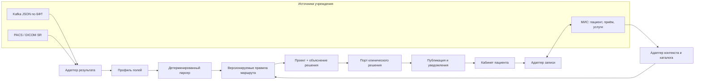
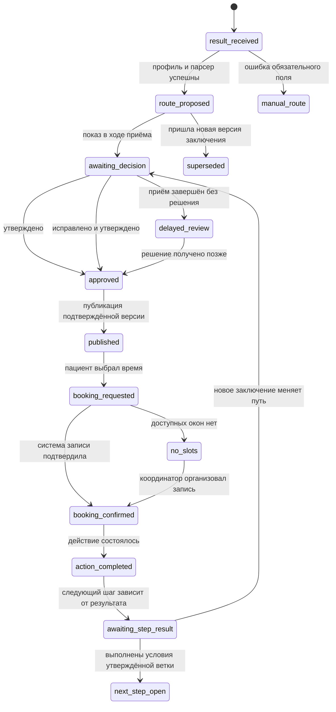

# Архитектура Patient pathway: маршрут пациента по заключению ИИ

**Статус:** рабочее архитектурное решение, обновлено 05.10.2026. Актуальная модель одного шага подробно описана в [next-step-cycle.md](next-step-cycle.md), а модель маршрутизации и обратная связь — в [model-routing.md](model-routing.md). Ниже сохранились некоторые проектные записи о прежнем движке правил; при расхождении приоритет имеют эти два актуальных документа.

**Назначение:** единая редактируемая точка правды для разработки.
**Источники:** обсуждение с заказчиком, `Кейс_Третье_мнение.pdf`, БФТ от 15.09.2026 (Kafka-message и шаблоны DICOM SR). Примеры БФТ не считаются промышленным контрактом конкретной клиники. Для демонстрации используются синтетические данные; реальные сообщения клиники сейчас недоступны.

Публичные источники и входные данные для медицинской матрицы вынесены в [research-and-matrix-inputs.md](research-and-matrix-inputs.md). Исполнимый план демонстрации и проверки универсальности — в [synthetic-demo-and-contracts.md](synthetic-demo-and-contracts.md). Этапы разработки и выбранные технологии с обоснованием — в [implementation-plan.md](implementation-plan.md) и [technology-stack.md](technology-stack.md).

Обозначения ниже: **принято** — договорённость проекта; **предлагается** — архитектурное решение для реализации; **открыто** — нужен ответ клиники или медицинского эксперта.

## 1. Цель и границы

**Принято.** Во время текущего приёма пациент проходит обследование. ИИ на стороне клиники формирует заключение; наш контур сразу получает его, разбирает известные поля и предлагает дальнейший путь. Специалист, проводящий обследование, видит путь и основания выбора, после чего может направить пациента. Учреждение определяет, кто именно принимает и подтверждает клиническое решение; модуль не назначает конкретного врача и не управляет его правами.

После подтверждения путь появляется у пациента в кабинете. Пациент может выбрать время, записаться, отменить запись или отказаться от доступного шага с категорией причины и позже вернуться к записи. Нейтральное SMS и помощь координатора остаются дополнительными каналами. Долгосрочное возможное сокращение участия врача — гипотеза заказчика, а не требование текущей версии: пока действует барьер подтверждения.

Сервис **не** анализирует изображения и не перепроверяет правильность диагностического заключения. Его задача — корректно преобразовать уже полученный результат в объяснимый проект **одного следующего действия**. **Главная идея продукта:** связанная цепочка версионируемых решений. Каждый следующий узел создаётся только после результата текущего и нового решения специалиста; клиника подключает источники и каналы через адаптеры и профили.

**Принято для первой версии.** Разбираем КТ органов грудной клетки и маммографию, в том числе скрининговые и диагностические исследования. Рентгенография ОГК переносится на следующий этап. Текущая модель CatBoost обучена повторять синтетическую матрицу и исполняется только в демонстрационном контуре; до клинического утверждения её выход не считается проверенной рекомендацией. Источником клинических фактов служит заключение ИИ; возраст, жалобы, история болезни и прежние исследования не запрашиваются. Технические идентификаторы для связи с текущим приёмом и статусы оказания услуг не поступают в модель.

### Неизменяемые правила

- Неподтверждённый проект пути не показывается пациенту и не запускает запись.
- Каждое предложенное действие связано с конкретными фактами, полями/фрагментами заключения и версией модели.
- Отсутствие обязательного значения, конфликт или неизвестная версия формата ведут к ручному решению, а не к догадке.
- Выбор слота не равен подтверждённой записи: подтверждение даёт система записи.
- Новое заключение не отменяет молча уже опубликованный маршрут или запись.
- Отказ пациента относится к одному шагу одной опубликованной версии. Он блокирует запись на этот шаг до возобновления, но не меняет клиническое решение и не переносится автоматически в новую версию.
- Исправления клинического решения сохраняются для аудита и разметки следующей версии модели; действующая модель не изменяется в ходе приёма.
- В одной версии маршрута не более одного клинического шага. Лабораторная подготовка может выполняться параллельно, но основной результат блокируется до принятого действующего результата анализа.
- Результат `followup_needed`/`replan` создаёт связанный ручной проект следующей версии; `resolved` закрывает текущий цикл, не утверждая медицинское выздоровление.
- Если правило требует признака «скрининг/диагностика» или иных отсутствующих сведений, система не подставляет значение по умолчанию и передаёт случай на индивидуальное решение специалиста.

## 2. Сквозной процесс во время приёма

```mermaid
sequenceDiagram
    participant AI as ИИ / PACS / Kafka
    participant Core as Ядро Patient pathway
    participant UI as Экран текущего приёма
    participant Clinic as Контур клиники
    participant Patient as Кабинет пациента
    AI->>Core: Заключение + идентификаторы исследования
    Core->>Clinic: Получить контекст приёма и каталог услуг
    Clinic-->>Core: encounter_id, доступные услуги
    Core->>Core: Профиль полей → парсер → факты → CatBoost
    Core->>UI: Проект пути + факты + основания + предупреждения
    UI->>Core: approve / edit_and_approve / reject
    alt Проект отклонён во время приёма
        Core->>Core: Сохранить отклонение + создать ручную версию v+1
        Core->>UI: Вернуть новый проект для исправления
        UI->>Core: edit_and_approve для версии v+1
        Core->>Patient: Опубликовать исправленный путь
    else Есть подтверждённая версия
        Core->>Patient: Опубликовать путь
        Patient->>Clinic: Запросить слот и запись
        Clinic-->>Patient: Подтверждённая запись или нет слотов
    else Приём закончился без решения
        Core->>Core: Отложенная проверка; не публиковать проект
    end
```

**Предлагается.** Основной поток рассчитан на активный приём. Ранее обсуждавшиеся очередь двух врачей и шестичасовой срок не входят в основной сценарий. Если результат ИИ опоздал, интерфейс или интеграция недоступны, путь можно составить вручную либо завершить приём с отложенной проверкой. Пациент получает путь лишь после подтверждения.

**Предлагается.** Измерять отдельно время `готовность SR → проект пути` и время `конец исследования → утверждённый путь`. Для локального парсера и правил целевой ориентир первого интервала — `p95 ≤ 2 с`, `p99 ≤ 5 с` при штатной нагрузке; это инженерная гипотеза для проверки нагрузочным тестом, а не норматив или обещание на весь приём. Время обработки у поставщика (до 60 секунд для маммографии и в среднем до 5 минут для КТ после получения изображения) не включает передачу, публикацию SR и решение специалиста. При превышении бюджета экран остаётся в состоянии ожидания с доступным ручным сценарием.

**Реализовано частично.** Для новых заключений измеряется интервал `начало разбора полей → проект перед коммитом`; p50/p95/p99 и число образцов доступны в `/api/v1/metrics`. Время начинается после получения тела и проверки источника. Отметок готовности SR и конца обследования пока нет, поэтому полный интервал внутри приёма и указанный целевой ориентир ещё нельзя проверить.

Также по сохранённым событиям измеряются `проект → решение специалиста` и `утверждение → публикация` для завершённых версий маршрута. Они позволяют увидеть задержку на внутреннем этапе проверки и в очереди worker; время поставщика ИИ и внешней доставки заключения остаётся за пределами измерения.

### Два продуктовых контура

**Контур текущего приёма:** готовое заключение → проект условного пути с основаниями → подтверждение, правка или отклонение специалистом → публикация точной утверждённой версии. Отклонение создаёт новую ручную версию для исправления в рамках приёма. Если заключение исправлено, новая версия снова проходит решение специалиста. Ценность этого контура — своевременный и проверяемый выбор дальнейших действий.

**Контур продолжения после приёма:** пациент видит один утверждённый следующий шаг и подготовку к нему, записывается или отказывается от шага с категорией причины. После отказа можно вернуться к записи. Подтверждение записи приходит из системы записи. Результат шага создаёт новый проект одного действия для решения специалиста либо завершает цикл. Ценность этого контура — довести решение до действия, сохранить обратную связь и измерить потери в пути.

```mermaid
stateDiagram-v2
    [*] --> available: Опубликованная версия, условия шага выполнены
    available --> declined: Пациент указал причину отказа
    declined --> available: Пациент вернулся к записи
    available --> booking_requested: Запрос записи
    booking_requested --> booked: Система записи подтвердила
    booking_requested --> available: Отказ системы записи / отмена
    booked --> available: Отмена подтверждена
    booked --> completed: Зарегистрирован результат шага; подготовка готова
    completed --> [*]: Продолжение не требуется
    completed --> suspended: Нужен следующий шаг, проект новой версии
    available --> suspended: Исправленное заключение ожидает решения
    declined --> suspended: Исправленное заключение ожидает решения
    suspended --> [*]: Опубликована новая версия; выбор пациента не переносится
```



Здесь `available` — доступность действия, а `declined` — отдельный выбор пациента, не статус клинического маршрута. При действующей записи сначала завершается её отмена, затем возможен отказ от шага. Во время пересмотра старый путь остаётся видимым, но новые действия с ним приостановлены. Воронка отдельно считает показ, отказ, возврат и подтверждённую запись; накопительные счётчики событий не образуют одну последовательную когорту.

## 3. Компоненты и границы интеграции



**Предлагается.** Ядро содержит каноническую модель, парсер, правила, версии маршрута, доказательства решения и переходы состояний. Адаптеры отделяют его от протоколов конкретного учреждения. Для MVP достаточно модульного backend; выделение сервисов возможно позже, если это подтвердят нагрузка и число независимых интеграций.

**Реализовано для синтетического контура.** IT-служба редактирует черновые `profiles.json` и `rules.json`, проверяет их и публикует одним CLI-выпуском. Неизменяемый файл релиза хранит оба набора, автора, причину и время; атомарно заменяемый указатель выбирает активный релиз. Каждый новый запрос читает одну пару, а принятое заключение сохраняет снимок, хеши и ID релиза. Файловые права пока определяют, кто может публиковать: промышленная авторизация и медицинское утверждение правил остаются отдельными задачами.

PACS рассматривается как возможный источник DICOM SR, а не как универсальная замена МИС или системы записи. Способ получения SR может отличаться между PACS. Перед внедрением нужен *DICOM Conformance Statement* конкретного продукта и проверка доступных сервисов, SR-объектов и уведомления о готовности. [DICOM PS3.2](https://dicom.nema.org/medical/dicom/2026a/output/chtml/part02/chapter_7.html), [DICOM SR IOD](https://dicom.nema.org/medical/dicom/2024e/output/chtml/part03/sect_A.35.html).

**Реализовано в синтетическом контуре.** Кроме ручной загрузки есть отдельный [подписанный HTTP-вход](report-ingress-contract.md) для BFT-подобного JSON и SR в base64. Он проверяет профиль, HMAC, время и ID сообщения до разбора отчёта, затем использует те же адаптеры и ядро. Это тестируемая граница источника для будущих транспортных адаптеров; Kafka consumer и получение SR из PACS/DICOMweb пока не реализованы. `report_ingress` в профиле необязателен, чтобы иной согласованный транспорт не требовал подменять HTTP-контракт.

### Профиль учреждения

| Независимая ось | Поддерживаемые варианты для проектирования |
| --- | --- |
| Результат ИИ | Kafka JSON по БФТ; DICOM SR из PACS |
| Контекст пациента и приёма | API/события МИС; локальные данные демо |
| Экран специалиста | Встроенный виджет; API для существующего интерфейса; экран демо |
| Возврат клинического решения | Синхронный API; асинхронное событие |
| Каталог услуг | API МИС/клиники; локальный каталог демо |
| Запись | API системы записи; задача координатору; локальная запись демо |
| Показ пациенту | Кабинет учреждения; подключаемый портал; экран демо |
| Уведомления | Шлюз учреждения; настроенный SMS-адаптер; заглушка демо |

Профиль выбирает **уже реализованные и проверенные** адаптеры. Иное расположение поля в известном формате решается конфигурацией сопоставления. Новый протокол или нестандартное поведение системы требует нового адаптера и контрактных тестов. Поэтому настройка сводит работу клиники к выбору профиля только в пределах поддерживаемых возможностей.

**Реализовано в синтетическом контуре:** у одной клиники может быть несколько профилей с общим `clinic_id`, например JSON и DICOM SR. Пара `clinic_id + study_uid` связывает их сообщения с одним случаем. Профиль сохраняется у каждой версии заключения, поэтому смена входного канала не меняет задним числом код услуги, способ записи или подпись ожидающего ответа. Источники обязаны согласовать нумерацию версий одного исследования; одинаковое клиническое содержание той же версии считается дублем, противоречие передаётся как конфликт, а не выбирается автоматически.

Подключение учреждения: (1) выбрать варианты по осям профиля; (2) получить реальные примеры сообщений и, для PACS, Conformance Statement **на этапе внедрения**, не для демонстрации; (3) настроить поля и коды услуг; (4) выполнить предпросмотр и контрактные тесты на успешных, исправленных и ошибочных сообщениях; (5) включить профиль на тестовом контуре, затем перенести утверждённую версию в рабочий. Этот процесс должен быть доступен IT-службе через конфигурацию и инструкции, без правки кода ядра. Если реальные сообщения отличаются от БФТ, изменяется профиль или адаптер конкретного учреждения; ядро маршрутизации не меняется.

## 4. Настройка полей и детерминированный разбор

**Принято.** NLP/LLM исключены. На входе ожидаются известные шаблоны и структурированные поля. Неизвестных имён полей в согласованном контракте быть не должно. БФТ, приложения 4, 9–11, задаёт начальный словарь для Kafka JSON и шаблонов SR: для КТ — группы находок, локализацию и измерения, для маммографии — PGMI, ACR, находки и BI-RADS по сторонам. Однако поля «Рекомендации» и «Дообследование» в шаблоне КТ опциональны, а сам БФТ не содержит утверждённого соответствия «находка → действие». До получения реальных сообщений парсер и профили проверяются на синтетических примерах, явно помеченных как синтетические. Это подтверждает поведение нашей системы относительно заданного контракта, но не совместимость с конкретной промышленной поставкой.

**Предлагается.** Для пары `source_system + format_version` и, где нужно, модальности хранить версионируемый *профиль полей*. Он задаёт источник, каноническое поле, тип, единицу, код, обязательность и разрешённое техническое преобразование. Пример настройки, **не промышленный контракт**:

```yaml
profile_id: clinic_a_bft_v1
source_format: bft_kafka_json
format_version: "1"
fields:
  - from: "$.studyIUID"
    to: "Case.study_iuid"
    type: string
    required: true
  - from: "$.aiResult.conclusion"
    to: "SourceReport.conclusion"
    type: string
    required: true
```

Для DICOM SR селектором выступает согласованный код понятия и путь в дереве SR, а не придуманное имя JSON-поля. IT-служба клиники или команда продукта могут изменять **техническое сопоставление** через валидатор, предпросмотр на тестовом сообщении, журнал изменений и откат. Произвольный код и клинически значимые значения по умолчанию в профиле запрещены. Медицинская матрица `факт → действие` хранится отдельно и меняется только после клинического согласования.

Важная граница: постоянство имён полей не доказывает постоянства **содержимого текстового поля**. Если дальнейший шаг зависит от свободной формулировки в `report` или `conclusion`, нужна фиксированная грамматика/словарь либо структурированный код от производителя. Синтетические формулировки покрывают только известную грамматику; при неподдержанной формулировке парсер воздерживается от вывода и показывает исходный текст для ручного решения.

### Канонические сущности

| Сущность | Существенные данные |
| --- | --- |
| `Case`, `Encounter` | `case_id`, `study_iuid`, `encounter_ref`, источник, модальность, статус |
| `SourceReport` | версия, `report`, `conclusion`, `prob_params`, модель ИИ, время получения |
| `ExtractedFact` | код, значение, отрицание/неопределённость, локализация, ссылка на поле/фрагмент |
| `RouteProposal`, `RouteStep` | версия проекта, правило, шаг, услуга, обосновывающие факты |
| `ClinicalDecision` | версия проекта, решение, исправленные шаги, причина, время, ссылка на проверяющего при наличии |
| `PublishedRoute`, `Booking`, `Event` | утверждённая версия, статусы записи, события воронки и аудита |
| `IntegrationProfile`, `FieldMappingProfile` | выбранные адаптеры и версии технического сопоставления |

У `Case` есть `exam_purpose: screening | diagnostic | unknown`. В рассмотренных полях БФТ отдельного признака назначения исследования нет, а источник вне БФТ пока не определён. Его можно брать из SR или согласованного поля направления/МИС, если клиника разрешит; отсутствие фиксируется как `unknown`. Модальность и название процедуры сами по себе не доказывают цель исследования. Для скрининговой КТ лёгких [ACR Lung-RADS](https://www.acr.org/Clinical-Resources/Clinical-Tools-and-Reference/Reporting-and-Data-Systems/Lung-RADS) и для случайно найденных узлов [Fleischner Society](https://pubs.rsna.org/doi/full/10.1148/radiol.2017161659) имеют разные области применения. Рекомендации Fleischner ограничены взрослыми от 35 лет и не рассчитаны, в частности, на скрининг, известный рак или иммуносупрессию. Пока эти данные не поступают, правило, требующее их, не применяется автоматически даже при последующем подтверждении пути специалистом.

Прямые идентификаторы пациента и контакты остаются в контуре учреждения; аналитика работает по `case_id`. Отображение клинических данных специалисту и пациенту требует разграничения доступа и аудита.

## 5. Клиническое решение, состояния и запись

Экран текущего приёма должен показывать: исходное заключение; извлечённые факты и их происхождение; предложенные шаги; идентификатор и версию правила; предупреждения о пропусках и конфликтах. Внешний контур учреждения возвращает `approve`, `edit_and_approve` либо `reject/manual_route` с идентификатором случая и версией проекта. Наш сервис хранит результат и причину правки, но не выбирает проверяющего. При `reject` создаётся новая ручная версия проекта с тем же заключением: исправление и утверждение возможны во время этого же приёма, отклонённая версия остаётся в истории, пациент не видит новую версию до утверждения.

**Принято.** Зависимый шаг открывается только после получения результата предшествующего шага, а не по факту записи или оказания услуги. **Предлагается.** Путь — версионируемый граф шагов, а не обязательная линейная цепочка. У шага есть тип действия, обоснование, желательный срок, техническое соответствие услуге, условия начала, условие подтверждённого завершения и ветки по результату. Шаг может быть записан заранее только если его выполнение не зависит от результата предшественника и такой параллелизм разрешён утверждённым правилом. Если результат шага А меняет выбор шага Б, Б остаётся условной веткой и не открывается для записи до получения результата А. При изменении клинического пути после результата А создаётся новая версия, которую вновь подтверждает специалист. Результат старой записи после замены маршрута и результат, пришедший во время проверки новой версии, также требуют нового ручного проекта: старое ожидающее решение становится устаревшим, а результат не открывает ветку текущего маршрута автоматически. Пациенту предлагается ближайший утверждённый доступный шаг; специалист видит условные продолжения и их основания.

Пакет оснований показывает не абстрактный «вклад признаков», а решающие условия правила: точные значения полей SR/JSON, ссылки на их происхождение, проверенные исключения, приоритет и версию правила. Если совпали несовместимые правила, автоматический выбор блокируется. В кабинете пациент видит краткий текст по шаблону, например «По результату исследования рекомендована консультация. Рекомендация подтверждена специалистом», и действие для записи; клинические детали остаются в заключении учреждения.

Код медицинской номенклатуры и идентификатор услуги для записи различаются. Для исходных исследований кандидатами служат `A06.09.005` (КТ органов грудной полости) и `A06.20.004` (маммография) по [номенклатуре Минздрава №804н](https://publication.pravo.gov.ru/Document/View/0001201711080036). Они не задают автоматически код следующего шага или слот. `RouteStep.action_type` сопоставляется с локальным `clinic_service_id` через версионируемый каталог учреждения; отсутствие сопоставления ведёт к задаче координатору или ручному решению. На просмотренных публичных страницах «Третьего мнения» каталог услуг для записи не найден.



Статусы маршрута, показа и записи хранятся отдельно: публикация не означает запись, а запись не означает состоявшееся действие. Повтор входного события дедуплицируется; исправленное заключение создаёт новую версию. Утверждение и постановка публикации должны быть атомарными, например через transactional outbox. Запись выполняется с ключом идемпотентности и подтверждается системой-источником истины.

При отсутствии слотов создаётся задача координатору. После публикации отправляется нейтральное SMS без диагноза; если записи нет через 48 часов — повторное SMS, ещё через 24 часа — задача на звонок в рабочее время. После записи или отказа цепочка останавливается. Отмена освобождает слот; причину можно предложить указать без блокировки отмены, а при неудобном времени предложить перенос.

## 6. Что нужно для начала разработки, демонстрации и пилота

**Можно разрабатывать и демонстрировать сейчас:** каноническую модель, интерфейсы адаптеров, движок профилей полей, парсер, движок правил, пакет оснований решения, состояния, журнал событий и симуляторы интеграций на синтетических данных. Демо должно прогонять одинаковые сценарии через минимум два профиля учреждения: условную частную клинику с Kafka/МИС и условное государственное учреждение с PACS/DICOM SR; оба должны приходить к одинаковым каноническим фактам и маршруту при равном содержании заключения.

| Приоритет | Недостающее решение или данные | Последствие отсутствия |
| --- | --- | --- |
| Демо | Синтетические JSON/SR, включая норму, находку, исправление, пропущенный контекст и повтор события | Позволяют проверить компоненты, инварианты и одинаковое поведение разных профилей; не доказывают совместимость с конкретной клиникой |
| Демо | Явно помеченная гипотетическая матрица для BI-RADS и лёгочных узлов | Показывает устройство правил и подтверждение специалистом; не является клинической рекомендацией |
| Внедрение | Реальные JSON/SR, версии и исправленные заключения | Нужны для настройки адаптера и контрактных проверок конкретного учреждения, но не блокируют разработку и демонстрацию |
| Клинический пилот | Утверждённая экспертами матрица `факт → шаг`, сроки, исключения и коды услуг | Без неё нельзя оценивать клиническую правильность маршрута |
| Внедрение | Источник `exam_purpose` или перечень правил, для которых допустимо `unknown` | Нельзя применять ветви, зависящие от цели исследования |
| Внедрение | Источник результата каждого шага, формат и связь с маршрутом | Нельзя создать связанную версию следующего шага в реальном контуре |
| Внедрение | Связь `studyIUID ↔ encounter_id ↔ пациент`, событие готовности ИИ; контракты решения, записи и кабинета | Нельзя надёжно встроить путь в текущий приём и опубликовать его |
| Внедрение | Conformance Statement PACS при выборе PACS, измерение задержки и сценарий при её превышении | Неизвестен объём адаптера и реальное время работы |
| Аналитика | Источник факта оказанной услуги и окно наблюдения | Нельзя корректно считать итоговую конверсию |

**Точки роста:** библиотека проверенных адаптеров; мастер настройки профиля с тестовым сообщением; контрактные тесты для каждой клиники; симулятор медицинских правил на размеченных кейсах; мониторинг задержки внутри приёма и причин ручных решений; несколько вариантов размещения без изменения ядра. Наблюдаемая конверсия считается по состоявшемуся визиту или завершённому обследованию. Чтобы утверждать причинный uplift, нужна сопоставимая контрольная группа.

## 7. Порядок изменений этого документа

Новые договорённости добавлять здесь с пометкой **принято / предлагается / открыто**. При изменении интерфейса источника обновлять таблицу профиля, пример сопоставления и контрактные тесты. При изменении клинической логики отдельно версионировать матрицу правил и сохранять автора медицинского утверждения. Диаграммы Mermaid редактируются прямо в Markdown вместе с текстом.
