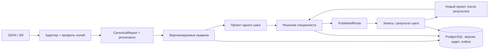

# План реализации Meditron от первого коммита до демонстрации

**Статус:** исторический технический план, составленный до перехода к модели одного шага. Текущую реализацию и инварианты см. в [next-step-cycle.md](next-step-cycle.md) и [implementation-status.md](implementation-status.md). Разделы ниже сохраняют исходный порядок работ и не являются актуальным контрактом маршрута.

## Целевой результат

За один демонстрационный проход показать: заключение ИИ в JSON или DICOM SR → нормализованные факты → объяснимый проект **одного следующего шага** → подтверждение или правку специалистом во время приёма → шаг в кабинете пациента → запись и при необходимости параллельная подготовка → результат услуги → новый связанный проект одного шага либо завершение цикла. Для двух эквивалентных входов ядро должно принимать одинаковое решение.



`provenance` означает точную ссылку от извлечённого факта к полю JSON или узлу SR. Параллельные задачи подготовки относятся к одному шагу; последующие клинические действия выражаются связанными версиями после результата.

## Структура репозитория

```text
meditron2026/
  backend/
    app/api/             # HTTP-контракты и обработчики
    app/domain/          # факты, правила, граф маршрута, состояния
    app/application/     # операции: принять, предложить, утвердить, записать
    app/adapters/        # JSON, SR, каталог, запись, уведомления
    app/persistence/     # SQLAlchemy, репозитории, outbox
    migrations/          # Alembic
    tests/               # доменные, контрактные, интеграционные тесты
  frontend/
    src/reviewer/        # экран специалиста
    src/patient/         # кабинет пациента
    src/demo/            # оболочка и выбор синтетического сценария
  fixtures/
    bft-json/            # синтетические сообщения по БФТ
    dicom-sr/            # сгенерированные синтетические SR
    expected/            # ожидаемые факты, маршрут и события
  infra/                 # Compose и необязательные симуляторы
  docs/
```

Первым пишется `domain/` как чистый код без FastAPI, SQLAlchemy и DICOM. Поэтому одни и те же правила доступны из любого адаптера и легко проверяются на фикстурах.

## Порядок реализации

### 0. Контракты демо и фикстуры

Определить канонические поля для КТ ОГК и маммографии по БФТ, формат `CanonicalReport`, `ExtractedFact`, `RouteStep`, `ClinicalDecision` и все статусы. Составить набор синтетических пар JSON/SR с одинаковым содержанием: норма, находка, две находки, отсутствие обязательного поля, неизвестный тип исследования, исправление и повтор. Ожидаемые факты и действия хранить отдельно от входных файлов. Медицинские действия обозначить `HYPOTHESIS`.

**Готово, когда:** для каждого сценария известны вход, ожидаемая нормализация, проект пути, условия публикации и ожидаемые события. Источник фикстуры и её синтетический статус видны в демо.

### 1. Каркас и хранение

Создать backend/frontend, Compose с PostgreSQL, миграции и запуск одной командой. Схема БД: `cases`, `source_reports`, `facts`, `rule_sets`, `route_versions`, `route_steps`, `clinical_decisions`, `bookings`, `service_mappings`, `integration_profiles`, `outbox_events`, `audit_events`. Сырые входные объекты хранить с ограничением доступа; в аналитические события писать псевдонимный `case_id`, а не контакт пациента.

**Готово, когда:** проект запускается на чистой машине, миграции проходят вперёд и назад, повторный запуск сохраняет данные.

### 2. Вход и нормализация

Сначала сделать BFT-JSON адаптер: проверка обязательных ключей и значений, профили полей, сохранение исходной версии, извлечение фактов. Затем SR-адаптер: чтение `.dcm`, обход `ContentSequence`, выбор элементов по кодам/пути, извлечение TEXT/NUM/CODE с единицами и ссылками на узлы. Не угадывать клинические значения из произвольного текста; известные шаблонные строки обрабатывать только через явную грамматику. Неподдержанный текст и конфликт значений переводят случай в `manual_route`.

**Готово, когда:** эквивалентные JSON и SR дают одинаковые нормализованные факты; неизвестная структура даёт объяснимое воздержание, а не неверное значение.

### 3. Движок медицинских гипотез

Описать небольшой набор разрешённых предикатов: `exists`, `equals`, `in`, `range`, `all`, `any`, `not`, с явными единицами и обязательным контекстом. Правило задаёт область применения, приоритет, исключения, действие, срок, зависимости и версию источника. Конфликт несовместимых правил и недостающий контекст приводят к ручному решению. Сохранять *trace*: факты, значения, выполненные и невыполненные условия, идентификатор и версию правила.

**Готово, когда:** первая матрица гипотез для BI-RADS и лёгочных узлов воспроизводится на фикстурах; изменение пути поля в профиле не меняет правило; изменение правила требует новой версии.

### 4. Маршрут, подтверждение и транзакции

Вычислять один ближайший клинический шаг с обоснованием и необязательной лабораторной подготовкой. Следующее действие создаётся отдельной версией после результата. Подтверждение специалистом принимает точную версию проекта: `approve`, `edit_and_approve` или `reject/manual_route`. При отклонении сохранять решение и создавать отдельную ручную версию проекта из того же заключения для исправления в текущем приёме. Утверждение, запись решения и outbox-событие публикации выполняются в одной транзакции. Повтор события входа определяется ключом источника, UID исследования и версией/хешем содержимого; устаревшее подтверждение отклоняется.

**Готово, когда:** неподтверждённый путь не виден пациенту, новый проект появляется только после результата, повтор события не создаёт дубликат, а исправленное заключение не переписывает опубликованный путь молча.

### 5. Экран специалиста и кабинет пациента

Экран специалиста: исходное заключение, решающие факты и ссылки на них, проект шагов, неизвестные условия, правка пути и подтверждение одним понятным действием. Кабинет пациента: краткая утверждённая причина, ближайший доступный шаг, выбор времени, статус записи и отказ/перенос. Демо-оболочка показывает оба экрана, но интеграционный API позволяет встроить их в сайт клиники. Текст пациенту хранить шаблонами, а не собирать свободной генерацией.

**Готово, когда:** человек может пройти полный сценарий без ручного изменения БД; экран специалиста показывает, почему предложен шаг, а пациент не видит неподтверждённую ветку.

### 6. Каталог, запись и результаты шагов

`action_type` сопоставить с локальным `clinic_service_id` через профиль учреждения. Запрос записи отправлять с устойчивым ключом идемпотентности; статус `booking_confirmed` ставить только по ответу системы записи. Отсутствие слотов переводит случай в задачу координатору. Результат следующего обследования принимать с явной ссылкой на шаг утверждённой версии; после него создавать связанный проект одного нового шага либо завершать цикл. Всякий новый проект снова требует подтверждения специалиста. Уведомления запускать из outbox после публикации и не включать диагноз в SMS.

**Готово, когда:** в демо можно записаться, получить отказ из-за отсутствия слотов, отменить запись и показать новую версию одного шага после результата и параллельную подготовку.

### 7. Два интеграционных профиля

Первый профиль получает BFT-совместимый JSON; второй — SR из симулятора PACS. Для демонстрации протоколов добавить тестовый Kafka broker и PACS-симулятор после завершения сквозного пути. Профили содержат разные селекторы полей и коды услуг, но используют один набор правил и доменных операций. Добавить страницу/команду предпросмотра сопоставления: вход → канонические факты → предупреждения. Клинические значения профилем IT-службы не изменяются.

**Готово, когда:** два эквивалентных исследования из разных профилей дают одинаковый проект маршрута, а смена каталога влияет лишь на возможность записи конкретной услуги.

### 8. Проверка, измерение и показ

Проверить доменные инварианты и контрактные примеры, затем пройти сквозной сценарий в браузере. Отдельно измерить `получен отчёт → проект`, ожидание специалиста и `утверждено → показано пациенту`. Воронка демо: `result_received → route_proposed → approved → shown → booking_confirmed → action_completed`. Показывать значения как технические результаты синтетического прогона, не как доказанный рост конверсии. Финальный показ должен включать один успешный сценарий, одну правку специалиста, параллельную подготовку, новый связанный шаг после результата, одно воздержание и переключение профиля учреждения.

**Готово, когда:** демонстрация запускается воспроизводимо из README, основные сценарии проходят без ручной подготовки, а метрики можно пересчитать из событий.

## Публичный API первого контура

Это **наши демонстрационные контракты**, не контракт «Третьего мнения» или клиники:

| Операция | Пример API | Результат |
| --- | --- | --- |
| Принять JSON или SR | `POST /api/v1/reports` | `case_id`, версия, статус разбора |
| Показать проект | `GET /api/v1/cases/{id}/proposal` | шаги, факты, trace, предупреждения |
| Вернуть решение | `POST /api/v1/cases/{id}/decisions` | утверждённая версия или конфликт версий |
| Показать пациенту | `GET /api/v1/routes/{id}` | только опубликованный доступный шаг |
| Запросить запись | `POST /api/v1/steps/{id}/bookings` | запрос и подтверждённый статус отдельно |
| Принять результат шага | `POST /api/v1/steps/{id}/results` | открытая ветка или новый проект на подтверждение |

Во всех изменяющих запросах предусмотреть `Idempotency-Key` или ключ события; в ответах и событиях передавать версию маршрута. Права на просмотр специалистом и пациентом передаются через согласованный механизм клиники; демо использует только фиктивные учётные записи.

## Что остаётся после демо

Настройка по промышленным SR/JSON, реальные контракты МИС/PACS/записи, утверждение медицинской матрицы, размещение в контуре учреждения, проверка доступа и аудит на реальных ролях, измерение полного времени во время приёма и пилот с контрольной группой. Эти работы нельзя заменить синтетическими фикстурами; при этом они не требуют переписывать доменное ядро, если его контракты выдержат проверки выше.
