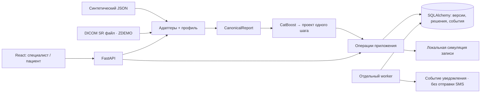
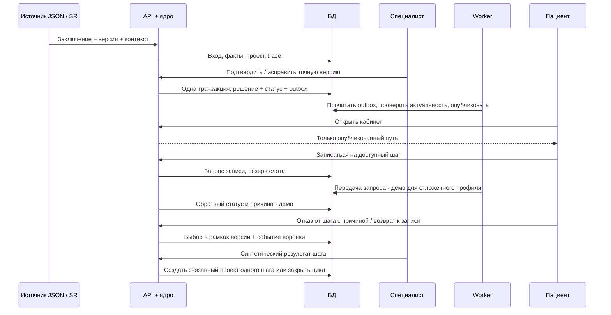
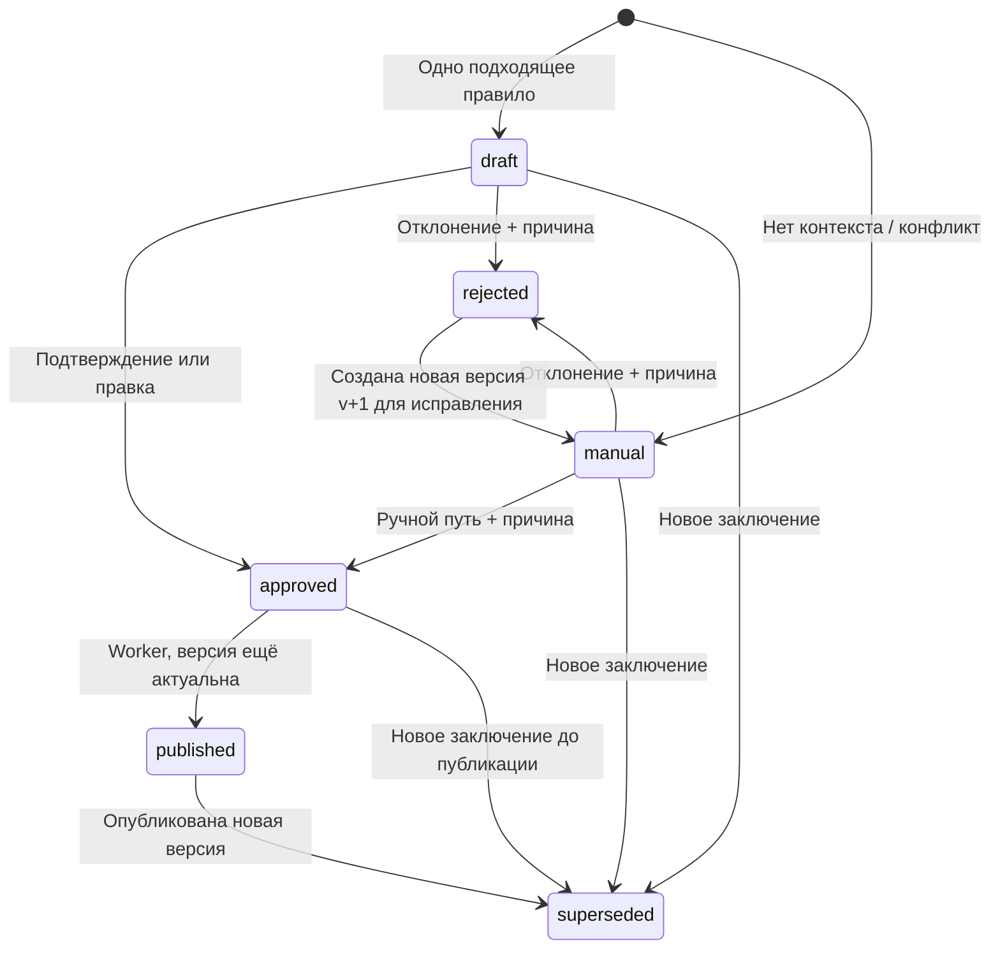

# Реализация v0.1 — исполняемый синтетический контур

Дата: 04.10.2026; обновление: 05.10.2026. Этот документ содержит исторические сведения о первоначальном движке правил. **Текущий рабочий выбор маршрута делает CatBoost** по распознанным полям; правила служат только синтетическим учителем для создания артефакта. Подробности и ограничения — в [model-routing.md](model-routing.md). Предметная архитектура: [architecture.md](architecture.md), [цикл одного шага](next-step-cycle.md). Выбранный стек: [technology-stack.md](technology-stack.md).

## Что реализовано

- Отдельный синтетический прогон качества `scripts/evaluate_fixtures.py` сравнивает извлечённые факты, решение о ручном разборе, полный контракт шагов и эквивалентность JSON/SR с независимыми ожидаемыми фикстурами; метрики и ограничения описаны в [evaluation-protocol.md](evaluation-protocol.md). Это не клиническая валидация.

- FastAPI API, чистое доменное ядро, SQLAlchemy и Alembic; отдельный процесс `worker` публикует утверждённые маршруты из transactional outbox.
- React/TypeScript: экран специалиста, ручное изменение маршрута с причиной, кабинет пациента, запись, отказ от шага с обязательной категорией причины и возврат к записи, запрос и подтверждение отмены, история и воронка.
- Два профиля: JSON по мотивам полей БФТ и DICOM SR с локальной схемой кодов `ZDEMO`. Оба преобразуются в `CanonicalReport` и подаются в одну версию модели.
- Отдельный предварительный подписанный HTTP-вход JSON/SR проверяет источник через HMAC-SHA256, временное окно, профиль и ID события до разбора тела. Повторы событий идемпотентны; изменения тела при прежнем ID отвергаются. Секреты профилей живут в окружении. Это не Kafka consumer и не получение из PACS; [контракт и ограничения](report-ingress-contract.md).
- Маммография: пара категорий BI-RADS; КТ ОГК: число узлов и назначение исследования. Поля извлекаются детерминированно, NLP отсутствует.
- В демонстрационном релизе направлений BI-RADS 3 ведёт к обсуждению контроля со специалистом по визуализации молочной железы, BI-RADS 4–5 — к специалисту по заболеваниям молочной железы; при известной цели КТ и ненулевом числе узлов предлагается консультация пульмонолога. Основание записано в описании шага, а исходные поля — в trace. Неизвестная цель КТ остаётся ручным разбором; выпот, коронарный кальций и эмфизема пока представлены только в [справочном каталоге](tag-catalog.md). Все направления остаются гипотезами для синтетики.
- Семь пар JSON/SR и независимые ожидаемые статусы/шаги в `fixtures/`. Генератор: `scripts/generate_fixtures.py`.
- Обязательное подтверждение точной версии пути, ручной выбор при недостающем контексте, защита от устаревших решений и повторов команд.
- Отклонение сохраняет неизменяемое решение и в той же транзакции создаёт новую ручную версию проекта на основе того же заключения. Специалист может исправить её и подтвердить в рамках текущего приёма; до этого пациенту новый путь не публикуется.
- В одной версии маршрута не более одного клинического шага. Результат `followup_needed` или `replan` создаёт новую связанную ручную версию **без предсозданного второго шага**; специалист указывает и утверждает следующее действие. Результат `resolved` закрывает цикл данного случая. Запись сама по себе не создаёт продолжение.
- Для единственного шага специалист может задать до трёх лабораторных задач подготовки. Условие `before_booking` требует результат до записи, `before_execution` разрешает параллельную организацию, но блокирует результат основного шага до принятой действующей подготовки. Учитываются отмены/отказы, срок действия, исправление статуса результата, пересечение слотов и порядок анализа перед основным приёмом в фиксированном деморасписании. Есть read-only API проверки готовности.
- Выбор пациента хранится для конкретного шага опубликованной версии: отказ блокирует запись, возврат снова её разрешает. Отказ при активной записи запрещён до подтверждённой отмены. Специалист видит отказ и категорию причины; события отказа и возврата входят в независимые счётчики воронки. Новая версия маршрута не наследует выбор автоматически.
- Аналитика явных выборов берёт когорту впервые показанных версий маршрута, окно после показа и первый отказ на каждом шаге. Она показывает число версий с отказом и возвратом, а также причины по ключу шага. Неоткрытый маршрут, решение до показа и решение после окна не приписываются когорте. Отсутствие записи не объявляется отказом; вывод предназначен только для синтетических данных.
- Исходный вход, нормализованные факты, указатели на поля, снимки профиля и прежней конфигурации с хешами, версия модели, исходный/исправленный маршрут и причина решения сохраняются в БД. Исправления не запускают автоматическое переобучение: сначала нужны нормализованная метка и экспертная проверка.
- Для одного входного запроса профиль и правила загружаются и проверяются как пара. Парсер, вычисление маршрута и сохранённый отчёт используют этот же снимок. Если файлы меняются во время обработки, уже начатый запрос не смешивает старые и новые настройки. Проверенная пара теперь публикуется через неизменяемый файловый релиз и атомарную замену указателя; черновые файлы не влияют на активный релиз до публикации.
- Коды услуг и режим записи для опубликованной версии читаются из её сохранённого снимка профиля; изменение файла профилей действует только на новые версии заключений. Обратный статус ожидающей записи также проверяется по исходному снимку до разбора тела. Проверены все четыре сочетания JSON/SR и двух деморежимов записи.
- Несколько технических профилей могут принадлежать одной клинике. Случай и пациентский токен остаются общими по `clinic_id + study_uid`, а каждая версия заключения хранит собственный `profile_id`; поздний ответ записи сверяется с профилем исходной версии. Совпадающее клиническое содержимое той же версии из другого формата дедуплицируется без учёта указателей на поля, конфликт даёт 409. Слот резервируется в области клиники. Номера версий через источники должны быть согласованы.
- Конкуренция за один слот защищена ограничением уникальности. Для отложенной подтверждённой записи запрос отмены сохраняет слот занятым до обратного ответа; подтверждение отмены освобождает его, отказ сохраняет запись и причину. Исходящая передача отмены пока симулируется через outbox. В профиле `private` локальный симулятор подтверждает запись сразу. В профиле `pacs` запрос проходит `requested → awaiting_confirmation → confirmed/rejected/no_slots`; обратный статус вводится через демонстрационный API, реальная клиника не вызывается. Отказ с причиной освобождает слот.
- При новой версии заключения запись приостанавливается до решения. Прежний опубликованный путь сохраняется до замены; существующие записи не отменяются автоматически и остаются видимыми после замены пути. Специалист может явно сохранить старую действующую запись в новом опубликованном маршруте, если совпадают доступный шаг и код услуги, с обязательной причиной. Исходная версия связи остаётся в БД, перенос записывается как отдельное событие. Поздний ответ системы записи относится к текущему согласованному маршруту.
- Для отложенного профиля есть отдельный вход обратных статусов с HMAC-SHA256, окном времени и уникальным ID события. Секрет хранится в переменной окружения, не в файле профиля. Это контракт нашего API; совместимость с реальным поставщиком не проверена.
- Технические профили и правила проверяются при запуске, перед использованием и отдельной командой. Для JSON и SR есть предпросмотр фактов и проекта маршрута без записи случая. Список клиник, модальности и режим записи демоинтерфейс получает из профилей API; встроенный генератор ограничен профилями с `demo_scenarios: true`.
- JSON-профиль поддерживает путь по вложенным объектам, индекс массива и выбор единственного элемента массива по строковому коду. Разбор сохраняет фактический путь к извлечённому значению; неоднозначный фильтр отклоняет сообщение. Это позволяет IT-службе менять сопоставление без изменения ядра для некоторых схем с массивами.
- Решения специалиста сохраняют категорию причины правки. Агрегированный обзор по профилю, модальности, назначению исследования, версии правила и типу изменения помогает выбрать кандидатов на экспертный пересмотр; без идентификаторов и свободных текстов в ответе. [Процесс использования правок и границы приватности](quality-loop.md).
- Журнал действий `events` отделён от изменяемого состояния доставки `outbox_events`. Команда и записи в обе таблицы фиксируются одной транзакцией; worker изменяет только outbox и создаёт новые записи журнала при обработке. Миграция переносит ожидающие события с теми же ID. В рабочем процессе каждое событие выбирается и коммитится отдельной транзакцией, поэтому worker удерживает блокировку только одного элемента очереди и его случая. Функция пакетной обработки для тестов сохраняет savepoint на каждый элемент. Сбой получает задержку перед новой попыткой (2, 4, 8, 16 секунд), после пятой попытки переводится в `failed` и не блокирует другие случаи. Операционный API показывает непроведённые события без payload и позволяет вручную повторить исправленное событие с причиной. Миграция устанавливает триггеры, запрещающие UPDATE и DELETE в `events`; на SQLite запрет, работа изменяемого outbox и откат миграции проверены. PostgreSQL-триггер ещё не испытан на живом сервере.
- Для каждой новой версии заключения сохраняется локальное время от начала разбора полей до создания проекта маршрута перед коммитом. `GET /api/v1/metrics` показывает число измерений и p50/p95/p99 в миллисекундах, в том числе по модальности и формату входа. Повторная доставка того же заключения не добавляет измерение; у старых версий значение отсутствует.

## Реальное устройство первого контура

Клинические факты и граф не зависят от HTTP, SQLAlchemy или DICOM. Граница подготовки записи выделена в `backend/app/adapters/booking.py`: профиль выбирает локальное подтверждение или отложенный ответ. Подписанный вход обратного статуса реализован для синтетического HTTP-контракта; следующий этап — настоящий исходящий вызов сервиса записи и согласование формата с клиникой. `api.py` пока один модуль; frontend — одна демо-оболочка. Перед расширением их нужно разделить по функциональным модулям.

Новая версия после публикации создаёт отдельный `draft/manual`, а не меняет опубликованный объект. Для результата `replan` тоже создаётся новая версия. Результат по прежней версии маршрута или результат, полученный во время ожидающей проверки, создаёт новый ручной проект на базе последнего заключения: прежний draft/manual/approved становится `superseded`, а worker не публикует устаревшее утверждение. Результат не переносится в новый граф автоматически. Опубликованный путь остаётся видимым, новая запись закрыта до решения специалиста; событие результата содержит ID результата, исходную версию и шаг без свободного текста. При отклонении старый проект остаётся `rejected` в истории, а новая версия `manual` получает копию шагов для исправления; это новый объект, показанный стрелкой на диаграмме. Повтор команды с тем же ключом не создаёт ещё одну версию. Правка с подтверждением может выполняться и сразу через `edit_and_approve`.

## Настройка подключения

Редактируется `config/profiles.json`:

| Настройка | Назначение |
| --- | --- |
| `input` | `json` либо `dicom` |
| `study_path`, `conclusion_path` | Пути в JSON |
| `fields.<modality>.<canonical_code>.path` | Путь к факту; поддержаны вложенные объекты через точку |
| `sr_scheme`, `sr_conclusion_code`, `fields.*.*.sr_code` | Схема кодов и код узла SR |
| `type`, `min`, `max`, `unit` | Ограничения технического контракта |
| `services` | Соответствие `action_type` к синтетическому коду услуги клиники |
| `booking_mode` | `local_simulator` либо `deferred_simulator` |
| `version` | Версия технического профиля |
| `demo_scenarios` | Разрешён ли встроенный генератор двух синтетических примеров |

Пример: перенести `mmg_rads_right.path` с `aiResult.probParams.mmg.mmg_rads_right` на `custom.right_category`. Ядро продолжает работать с `mmg_rads_right`. Для проверки JSON есть `POST /api/v1/profiles/private/preview`, тело такое же, как у JSON-входа. Клиническая матрица хранится отдельно в `config/rules.json`.

[Пошаговая настройка профиля и команды предпросмотра](configuration-guide.md).

Конфигурация проверяется по схеме Pydantic и связям с правилами. CLI `python -m app.config_publish --author ... --reason ...` сохраняет неизменяемый релиз с метаданными и атомарно переключает активный указатель; каждый запрос читает одну пару профилей и правил. Снимок и ID опубликованного релиза сохраняются при приёме заключения. UI редактора и промышленное разграничение полномочий на публикацию отсутствуют; для контейнера релиз поставляется с образом. SR поддерживает однозначные NUM/TEXT-узлы заданной схемы; повтор одинакового кода отвергается, произвольный SR не угадывается.

## API

Интерактивное описание после запуска: `http://127.0.0.1:8000/docs`.

| Операция | Endpoint |
| --- | --- |
| Принять JSON | `POST /api/v1/reports/json` |
| Принять SR-файл и контекст | `POST /api/v1/reports/dicom` |
| Подписанный вход JSON/SR | `POST /api/v1/integrations/reports/json`, `POST /api/v1/integrations/reports/dicom` |
| Профили / предпросмотр JSON и SR | `GET /api/v1/profiles`, `POST /api/v1/profiles/{id}/preview`, `POST /api/v1/profiles/{id}/preview-sr` |
| Список / детали для специалиста | `GET /api/v1/cases`, `GET /api/v1/cases/{id}` |
| Решение специалиста | `POST /api/v1/cases/{id}/decisions` |
| Согласовать прежнюю запись с новым маршрутом | `POST /api/v1/cases/{id}/bookings/{booking_id}/reconcile` |
| Кабинет пациента | `GET /api/v1/patient/cases/{id}` |
| Зафиксировать показ | `POST /api/v1/patient/cases/{id}/shown` |
| Отказ от шага / возврат к записи | `POST /api/v1/patient/cases/{id}/steps/{step_key}/decline`, `POST .../steps/{step_key}/resume` |
| Запись / отмена | `POST /api/v1/patient/cases/{id}/bookings`, `POST .../bookings/{booking_id}/cancel` |
| Обратный статус записи в демо | `POST /api/v1/demo/bookings/{booking_id}/feedback` |
| Подписанный вход для интеграции | `POST /api/v1/integrations/bookings/{booking_id}/feedback` |
| Результат шага | `POST /api/v1/cases/{id}/results` |
| Воронка | `GET /api/v1/metrics` |
| Агрегированный обзор правок | `GET /api/v1/quality/rule-review` |
| Состояние outbox / ручной повтор | `GET /api/v1/operations/outbox`, `POST /api/v1/operations/outbox/{event_id}/retry` |
| Создать демо / исправление | `POST /api/v1/demo/cases`, `POST /api/v1/cases/{id}/demo-revision` |

Команды используют `Idempotency-Key`: тот же ключ и тело возвращают прежний результат; другое тело даёт 409. На PostgreSQL перед чтением команды запрашивается транзакционная advisory-блокировка по хешу области и ключа, чтобы два одновременных запроса не прошли проверку отсутствующей строки одновременно. В локальной SQLite проверен одновременный повтор одним ключом; PostgreSQL-код проверен только на формирование запроса, не на живом сервере. Читающие экраны больше не запрашивают блокировку строки случая, а изменяющие операции сохраняют её. Для подписанного статуса роль ключа играет `X-Event-Id`, уникальный в пределах профиля источника. Входные отчёты сопоставляются по клинике, UID и версии: клинически одинаковое содержимое из разных профилей дедуплицируется с тем же `route_id`, конфликт отклоняется. Для PostgreSQL до поиска ещё не созданного случая берётся транзакционная advisory-блокировка по `clinic_id + study_uid`; на SQLite параллельная доставка одного исследования проверена, на живом PostgreSQL — ещё нет. Показ дедуплицируется по версии опубликованного пути. Коммит команды заканчивается до HTTP-ответа. [Формат подписи и ограничения](booking-feedback-contract.md).

Операционный список outbox требует демороль специалиста и возвращает только метаданные, без payload. Ручной повтор принимает `{"reason": "..."}` и `Idempotency-Key`, доступен лишь для `failed`. Он не исправляет исходное событие: перед повтором нужно устранить причину сбоя, иначе оно вновь исчерпает попытки. Worker пишет в лог ID события, число попыток и безопасный код ошибки без текста исключения; общий сбой итерации также логируется только типом ошибки, без текста и SQL-параметров.

Согласование прежней записи принимает `{"action": "carry_over", "target_route_id": "...", "reason": "..."}` и `Idempotency-Key`. Требуются опубликованная актуальная версия без ожидающего пересмотра, активная запись и доступный шаг с тем же `step_key` и кодом услуги. Запись не переоформляется во внешней системе: сохраняются её слот и `external_ref`, а новый маршрут становится эффективным для показа, результата шага и позднего подтверждения. Для несовместимого шага или услуги перенос запрещён; запись остаётся видимой и блокирует новую до отдельного согласования или отмены. Реальная отмена во внешней системе пока не реализована.

Роль специалиста задаётся заголовком `X-Demo-Role: reviewer`. Пациентский доступ — `X-Patient-Token`, отдельный случайный токен на случай. Общая оболочка демо переключает роли и получает эти токены: **это не промышленная авторизация**. Реальные персональные данные не загружать; проверка флага `synthetic` — ограждение демонстрации, а не механизм анонимизации.

### Метрика записи

`GET /api/v1/metrics` возвращает два разных вида данных. `counts` — независимые накопительные счётчики уникальных случаев для каждого события, включая `step_declined` и `step_resumed`; их нельзя трактовать как одну последовательную когорту. `booking_conversion` и `conversion_details` относятся к **показанным версиям маршрута**: знаменатель — число впервые показанных версий, числитель — версии, по которым пациент запросил запись после показа и получил подтверждение в окне атрибуции. По умолчанию окно составляет 7 дней от первого показа; `attribution_days` принимает 1–30. Повторный показ той же версии не увеличивает знаменатель. Старые события `booking_requested` без `route_id` связываются с исходной версией записи из БД.

`patient_choices` использует ту же когорту показанных версий и окно. `route_versions_with_decline` считает версии хотя бы с одним явным отказом, `route_versions_with_resume` — версии, где после отказа был возврат к тому же шагу. `by_step` считает первые отказы по парам «версия маршрута + шаг», причины первого отказа и возвраты. Сумма по шагам может превышать число версий. Отсутствие записи не считается отказом или потерей пациента. Обзор доступен только в синтетическом демо; перед использованием на реальных данных нужны разграничение доступа и подавление малых групп.

Для когорты показов доступны необязательные параметры `shown_from` и `shown_before` с часовым поясом; конец интервала исключается. `provisional_route_versions` показывает число ещё не конвертировавшихся версий, у которых окно не закрылось: конверсия такой когорты может измениться. Подтверждение записи после окна, по другой версии маршрута или без запроса после показа не считается. Отмена не вычитает ранее подтверждённую запись: это **валовая конверсия в подтверждение записи**, а не доля действующих записей или состоявшихся визитов. `uplift` остаётся `null`, поскольку контрольной группы нет. Текущий расчёт просматривает события и записи в памяти приложения; на реальном объёме понадобится отдельный аналитический контур или инкрементальная агрегация.

`routing_latency` считает p50/p95/p99 методом nearest rank по сохранённым длительностям новых заключений. Таймер начинается после получения HTTP-тела и проверки подписи, непосредственно перед разбором JSON/SR, и останавливается после формирования проекта перед коммитом. Он не включает сеть, получение и анализ изображения поставщиком ИИ, ожидание SR в PACS/Kafka, решение специалиста и публикацию пациенту. Это локальная синтетическая метрика; целевой SLA при реальной нагрузке не проверен.

`workflow_latency` отдельно считает интервалы `route_proposed → approved/route_rejected` и `approved → published` по временным отметкам сохранённых событий одной версии маршрута. API возвращает число пар и p50/p95/p99; неполные пары и отрицательные интервалы не входят в выборку. Первый интервал включает ожидание решения специалиста, второй — очередь и публикацию worker. Это не время от конца обследования или готовности SR: этих отметок источник пока не передаёт. Метрики показывают только завершённые пары и могут быть смещены при незавершённых маршрутах; часы разных узлов в реальном развёртывании потребуют синхронизации.

## Проверки и границы

Проверено 04.10.2026 после обновления направлений: **105 backend-тестов, Ruff, проверка конфигурации и сборка TypeScript/Vite прошли**. Локальный запуск `scripts/dev.sh` проверен на отдельной SQLite базе и портах: `/health`, `/docs` и главная страница ответили HTTP 200. Семь браузерных тестов Chromium проходили до обновления направлений; после него повторно не запускались. Миграции `upgrade → downgrade → upgrade`, отсутствие расхождения схемы, заполнение `clinic_id` и профиля старых отчётов, сохранение существующей записи и заполнение `unspecified` для прежнего решения проверены на временной SQLite. Тестовая библиотека выдаёт предупреждение об устаревании интеграции Starlette TestClient с `httpx`; на выполнение проверок оно не влияет.

- Backend: правила и конфликты, типы/поля, эквивалентность JSON/SR, общий случай для двух профилей одной клиники и конфликт версий, фикстуры, подписанный вход JSON/SR и проверка источника/повторов, решения/версии, outbox с изоляцией ошибки и ручным повтором, повторные команды, синхронная и отложенная запись, согласование прежней записи с новой версией, позднее подтверждение, обратные статусы/отказы, локальная и отложенная отмена с обратным статусом, условия результата, изоляция пациентских токенов, метрики, агрегаты правок без прямых идентификаторов, миграции вперёд/назад.
- Браузер: весь путь с правкой и категорией причины, сводка правок, ручное решение для SR с неизвестным назначением, исправленное заключение, отложенное подтверждение записи, мобильный экран без горизонтального переполнения.
- Демо работает локально с SQLite; транзакции сериализованы через `BEGIN IMMEDIATE`. Одновременный повтор команды с одинаковым ключом и доставка одного исследования с разными ключами проверены на SQLite. PostgreSQL advisory-блокировки и `SKIP LOCKED` нескольких worker требуют отдельной проверки на живой PostgreSQL; локальные тесты её не заменяют.
- Compose для PostgreSQL, API, worker, frontend подготовлен. Docker на текущей машине отсутствует; сборка и работа Compose здесь **не проверены**.
- Накопительные счётчики и конверсия по показанным версиям маршрута разведены; когорта и порядок событий учитываются. Отмены и контрольная группа в конверсии не учитываются; период наблюдения задаётся окном атрибуции, но не доказывает итоговую конверсию в состоявшийся визит.

## Следующие приоритеты

1. Проработать продуктовые сценарии двух контуров на синтетических данных: возвращение после отказа, помощь при отсутствии времени, повторный контакт, изменение маршрута после результата и понятный статус каждого шага. Зафиксировать ожидаемое поведение в матрице состояний, затем расширить UI и события воронки. Сейчас реализован базовый отказ/возврат; повторные контакты не автоматизированы.
2. С экспертами уточнить медицинскую матрицу для маммографии и КТ, сроки, направления и исключения. Текущие названия специалистов и причины — демонстрационные гипотезы; `ZDEMO` не является реальным SR поставщика.
3. Развить аналитику после явных отказов: видеть помощь координатора и подтверждённую запись после возврата, причину и результат последующего действия. Когорта показанных версий и причины по шагам уже доступны только на синтетике. Для реального контура нужны разграничение доступа и подавление малых групп; для uplift — сравнимая контрольная группа.
4. Для пилота подключить настоящий транспорт записи, отмены и обратных статусов; согласовать контракты с клиникой. Локальное сохранение совместимой записи между версиями пока меняет связь только в нашем контуре.
5. Проверить PostgreSQL, конкурентные транзакции и нескольких worker на живом сервере, затем включить эти проверки в CI.
6. Согласовать реальные Kafka/JSON и PACS/DICOM SR образцы, добавить транспортные адаптеры и расширить селекторы только под обнаруженные схемы. Текущий подписанный HTTP-вход — предварительный мост для демонстрации.
7. Ввести промышленную идентификацию, полномочия по учреждению, журнал автора решения и медицинское утверждение правил; затем встроить интерфейс в рабочее место и кабинет клиники.
8. Измерить полный интервал от готовности SR до утверждённого маршрута и проверить p95/p99 при реалистичной нагрузке; текущий таймер покрывает только разбор и создание проекта.
