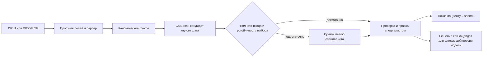

# Маршрутизация Patient pathway: CatBoost и решения специалиста

**Статус на 05.10.2026:** CatBoost подключён к синтетическому контуру. Клиническая эффективность не измерена. Рабочий выбор проекта маршрута выполняет модель; `config/rules.json` остался учебным источником меток для воспроизводимого обучения и старого формата конфигурации, но предикаты правил во время обработки заключения не исполняются.

## Почему эта модель

Вход после парсера — таблица признаков, а не свободный текст: модальность, назначение исследования и значения кодированных наблюдений. CatBoost работает с числовыми и категориальными признаками, умеет учитывать их сочетания и даёт вклад признаков в конкретный прогноз. Это разумная база для расширения на большее число кодов и полей. Сложность модели сама по себе не подтверждает качество: сравнение с простым деревом и проверка на независимой разметке остаются обязательными при появлении данных.

Текущий бинарный артефакт обучен на **76 синтетических комбинациях** текущей демонстрационной матрицы: 50 сочетаний BI-RADS и 26 сочетаний числа узлов/назначения КТ. Пять классов означают отсутствие следующего шага или один из четырёх типов консультации. Совпадение с учителем на обучающих комбинациях — только проверка воспроизведения, не точность на реальных данных. В текущем парсере для модели доступны три числовых поля: `mmg_rads_right`, `mmg_rads_left`, `ct_lc_num`; БФТ описывает больше полей, но мы не приписываем неиспользуемым полям влияние.

Модель предлагает класс следующего действия, а не ставит диагноз и не назначает конкретного врача или слот. Указатели на поля SR и вклады признаков показываются специалисту как техническое объяснение модели, не как доказательство клинической причинности. Если обязательное поле отсутствует, неизвестно назначение КТ или оценка выбранного класса ниже заданного порога, проект требует ручного решения. Публикация пациенту всегда требует решения специалиста.

## Правки и обновление версии

1. Каждое `approve`, `edit_and_approve`, `reject` и итоговый шаг уже сохраняются с версией проекта. Исправление действует **сразу для данного пациента**: в кабинет идёт утверждённый специалистом маршрут.
2. Для обучения берём только изменения клинического действия. Чистая правка формулировки меняет шаблон текста, а не метку модели. Причину `insufficient_context` рассматриваем отдельно как пример для ручного выбора.
3. Перед обучением эксперт сопоставляет исправленное действие с нормализованным кодом целевого шага/специальности, проверяет противоречия и убирает идентификаторы и свободный текст. Сейчас интерфейс хранит в основном название шага и тип услуги; отдельного подтверждённого кода специальности нет. Это следующий контракт данных, без которого автоматическое дообучение по тексту правки было бы ненадёжным.
4. Накопленные и проверенные метки входят в следующую **пакетную** тренировку. Новая версия проходит набор неизменных сценариев, проверку новых случаев и независимую клиническую оценку. Только после одобрения её публикуют атомарно; предыдущая остаётся доступной для отката и аудита.

В текущем демо артефакт и манифест проверяются по SHA-256 и кэшируются процессом; после выпуска новой версии API нужно перезапустить. Независимого сервиса реестра моделей и горячего переключения ещё нет.

Текущий код **не переобучает действующую модель после каждого решения врача**. Такая замена могла бы ухудшить маршруты других пациентов и сделать результат невоспроизводимым. Исправления уже сохраняются как сырьё цикла качества; конвейер экспертной разметки и выпуска следующего артефакта остаётся этапом пилота.

## Источники данных для проверки

| Источник | Чем полезен | Ограничение |
| --- | --- | --- |
| [NLST/CDAS](https://cdas.cancer.gov/datasets/nlst/) | КТ скрининг, наблюдения, рекомендации диагностического продолжения и фактически выполненные процедуры. Подходит для исследования структуры признаков КТ и внешних задач по follow-up. | Полный CSV/SAS доступен после одобрения проекта и соглашений. Это не БФТ SR и не готовые классы наших специалистов. |
| [MIMIC-IV 3.1](https://physionet.org/content/mimiciv/3.1/) | Заказы, процедуры, лаборатория и госпитальные события для исследования связанного процесса. | Требует credentialing и DUA; популяция госпитальная, отличается от скрининга/приёма. Радиологические тексты в отдельном [MIMIC-IV-Note](https://physionet.org/content/mimic-iv-note/2.2/), также с ограниченным доступом. |
| [ClinicalTrials.gov](https://clinicaltrials.gov/) | Поиск протоколов и публикаций для оценки конкретных вмешательств и каналов напоминания. | Реестр исследований и сводных результатов не предоставляет автоматически размеченные заключения SR и решения врача по маршруту. |
| Локальная разметка учреждения | Наиболее близка к целевым полям БФТ, каталогу услуг и фактическим исправлениям специалиста. | Требует контракта, прав на использование, экспертной проверки и отдельной независимой выборки. |

## Проверка качества на пилоте

Основная метрика — доля случаев, где **утверждённый специалистом код следующего шага** входит в top-1 модели; отдельно считаются recall по редким/важным категориям, доля ручного выбора и частота правок. Разбиение по учреждению, времени и исследованию должно предотвращать попадание разных версий одного случая в обучение и проверку. Конверсия в запись и визит — продуктовые метрики; они не заменяют проверку качества маршрута. Порог уверенности обучающего артефакта не трактуем как клинический порог без калибровки.

**Технические источники выбора:** [CatBoost: категориальные признаки](https://catboost.ai/docs/en/features/categorical-features), [CatBoost: вклад признаков](https://catboost.ai/docs/en/features/feature-importances-calculation), [ВОЗ: evidence framework для медицинского ИИ](https://www.who.int/publications/i/item/9789240038462).
