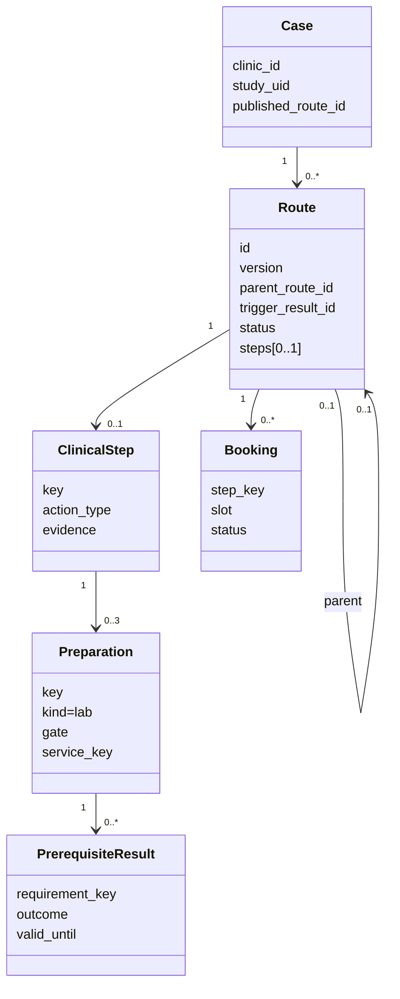
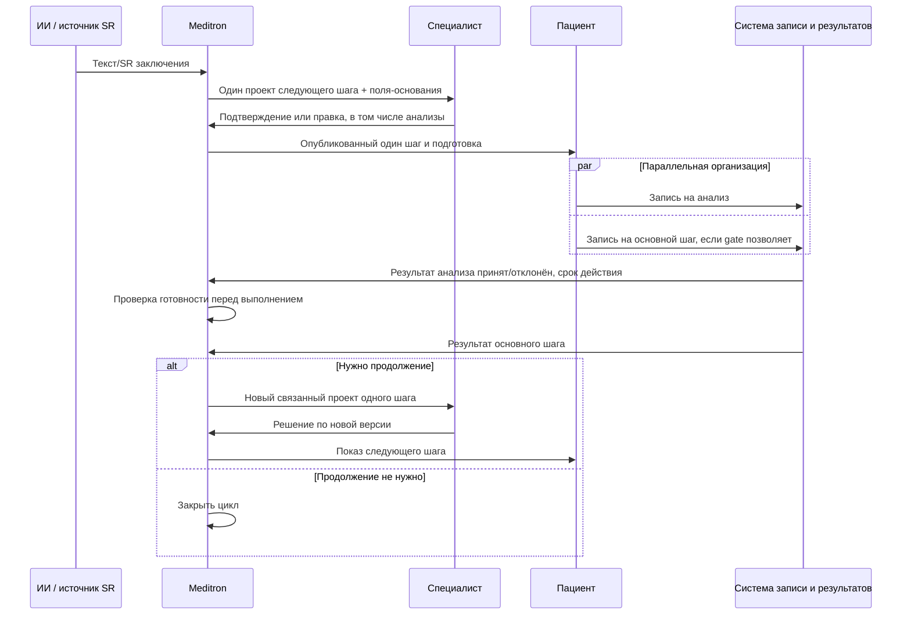

# Один следующий шаг и повторяемый цикл

**Статус:** реализовано в синтетическом демо 04.10.2026. Клинические правила и лабораторные назначения остаются гипотезами до утверждения учреждением.

## Решение

Одна версия маршрута содержит **не более одного клинического действия**: консультацию, повторный приём, исследование или процедуру. Сервис не угадывает весь будущий путь по одному заключению. После результата действия специалист решает, нужен ли ещё один шаг. Если нужен, создаётся **новый проект версии**, связанный с предыдущей версией и результатом; до его подтверждения пациент видит прежний утверждённый шаг, но не может записаться на новый. Если продолжение не нужно, цикл закрывается. Статус `resolved` означает завершение этого маршрута, а не доказанное выздоровление.

Вокруг единственного действия могут идти до трёх **задач подготовки**. В демо поддержан тип `lab`. Это не вторые клинические шаги и не рекомендации, автоматически извлечённые из SR. Специалист указывает их при правке маршрута; профиль клиники сопоставляет `service_key` коду услуги. Задача имеет одно из двух условий:

| Условие | Запись на основной шаг | Получение результата основного шага |
| --- | --- | --- |
| `before_booking` | Только после принятого и действующего результата анализа | После подтверждённой записи и всех действующих результатов подготовки |
| `before_execution` | Параллельно с записью на анализ, но основной слот должен быть позже ещё не готового анализа | Только после принятого и действующего результата анализа |

Одинаковое время для двух услуг одному пациенту запрещено. В демо порядок сравнивается для трёх фиксированных слотов одного дня. Перед реальным внедрением система записи должна проверять **точные даты, длительность процедуры, время получения результата и срок его действия на момент оказания**; этих данных в текущем контракте нет. До лабораторного результата нельзя зарегистрировать результат основного шага, даже если он уже записан. Отрицательный, исправленный на отрицательный или просроченный результат вновь закрывает это условие. Сам факт оказания лабораторной услуги не открывает основной шаг.

Назначение конкретного анализа зависит от вида услуги, протокола учреждения и клинического контекста. SR маммографии/КТ сам по себе не даёт универсального основания назначать анализы. Поэтому список анализов для каждой услуги должен утвердить специалист, а демо-услуга `lab_demo` и её данные являются синтетическими.

## Связи данных

`parent_route_id` и `trigger_result_id` создают проверяемую цепочку решений. Исправление заключения также создаёт новую версию и снова требует подтверждения. Предыдущие версии и записи не перезаписываются молча.

## Процесс

Состояния следующей версии: `proposed/manual → approved → published → booking → result → proposed/manual | closed`. Переход `result → proposed/manual` выполняется по событию `followup_needed` или `replan` и **не** строит второй шаг по старым правилам. Он ждёт нового решения специалиста. Демо различает событие «получен результат» и событие «подтверждена запись».

## Как демонстрировать

1. Создать синтетическое заключение и показать единственный проект с основаниями из полей.
2. Специалист добавляет подготовительный анализ `before_execution`, утверждает версию.
3. Пациент записывается на основной шаг и отдельно на анализ; анализ ставится раньше основного приёма.
4. Пока нет принятого результата анализа, `GET /api/v1/cases/{case_id}/steps/{step_key}/clearance?route_id=...` возвращает `ready=false`, а регистрация результата основного шага запрещена.
5. Зарегистрировать принятый результат анализа, затем результат основного шага `followup_needed`. Появляется ручной проект новой версии с `parent_route_id` и `trigger_result_id`.
6. Специалист задаёт **один** новый шаг и утверждает его. Пациент видит следующую версию. Повторить цикл или завершить его с `resolved`.

Лабораторный результат передаётся в `POST /api/v1/cases/{case_id}/prerequisite-results` как статус и срок действия без значений анализов. API записи принимает ключ основного шага или ключ подготовки. Точные схемы доступны в `/docs` после запуска. В текущем прототипе обратный результат вводится через демонстрационный интерфейс/API; клинический интерфейс источника результата ещё не согласован.

## Граница текущей реализации

- Цикл действует **внутри одного Case**, который определяется `clinic_id + study_uid`. Связывание новых исследований с новым `study_uid` в одну долгую историю потребует отдельного псевдонимного `pathway_ref` и контракта МИС; пока оно не реализовано.
- `before_execution` проверяется при регистрации результата шага и через read-only endpoint `clearance`. Промышленная система оказания услуг должна вызывать проверку непосредственно перед выполнением и учитывать срок действия результата на дату приёма.
- Текущие слоты и коды услуг демонстрационные; реальные расписания, лабораторные результаты и уведомления не интегрированы.
- Клиническая достаточность самого результата анализа не определяется программой; `accepted/rejected` приходит от ответственного контура. Медицинское утверждение матрицы и правил подготовки обязательно до пилота.

Для будущих контрактов полезно разделять назначение услуги, рабочую задачу и диагностический результат, как в [FHIR ServiceRequest](https://hl7.org/fhir/R4/servicerequest.html), [Task](https://hl7.org/fhir/R4/task.html) и [DiagnosticReport](https://hl7.org/fhir/R4/diagnosticreport.html). Это ориентир модели обмена, не обещание совместимости текущего API с FHIR.
