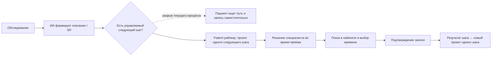
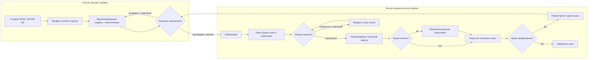
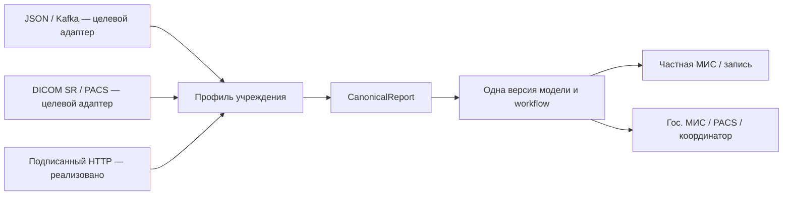
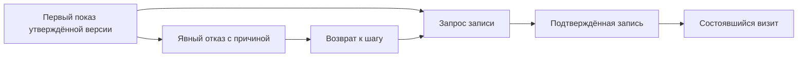

# Схемы для слайдов и обсуждения

Формальная BPMN 2.0 находится в [workflow.bpmn](workflow.bpmn). В ней показаны **участники и сообщения**, а не только цепочка функций. Диаграммы ниже помогают быстро читать питч без BPMN-редактора.

## 1. Где появляется продукт

Пунктир — **гипотеза операционной проблемы**, не измеренная доля потерь.

## 2. Два связанных контура продукта

## 3. Профиль вместо переписывания ядра

Подписи «целевой» и «реализовано» обязательны: промышленная совместимость ещё не доказана.

## 4. Воронка доказательства эффекта

Основная текущая метрика: `C / A` в окне атрибуции для той же версии маршрута. `D / A` — будущая конечная бизнес-метрика, когда появится надёжный статус оказания услуги. `uplift` требует контрольной группы; сейчас он неизвестен.

## 5. Небольшая дорожная карта с воротами качества

| Этап | Результат | Условие перехода |
| --- | --- | --- |
| **0. Синтетический MVP — выполнено** | Два контура, JSON/SR, правка и подтверждение, запись, результат, аналитика | Автотесты и демонстрация на синтетике |
| **1. Контракты и разметка** | Реальные обезличенные образцы, коды услуг и утверждённые метки следующего шага | Эксперт утвердил целевые действия; контрактные тесты проходят |
| **2. Теневой режим** | Приём реальных SR без публикации пациенту | Измерены полнота разбора, доля ручных случаев и время «SR → проект» |
| **3. Ограниченный пилот** | Экран специалиста, публикация и запись в одной клинике | Проверены обратные статусы, безопасность, контрольная группа и согласованные пороги |
| **4. Масштабирование** | Профили второй клиники и вариант PACS/МИС | Повторяемое подключение без правки ядра; доказана операционная ценность |

Сроки не привязаны к календарю до получения контрактов и эксперта. Это последовательность проверок, а не обещание запуска за фиксированное число недель.
