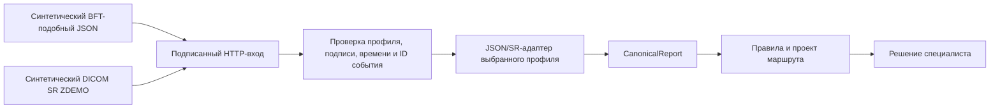

# Подписанный вход заключений — предварительный контракт

Статус: синтетический демонстрационный мост, 04.10.2026. Это **наш** HTTP-контракт для проверки границы источника, идемпотентности и двух адаптеров. Он не объявлен контрактом «Третьего мнения», Kafka, PACS или конкретной клиники. Настоящие потребители Kafka и получение SR из PACS/DICOMweb должны согласовываться отдельно; они смогут вызывать то же приложение после приведения входа к профилю.



## Адреса и тело

Оба адреса принимают `POST` с `Content-Type: application/json` и телом до 3 МБ. Query-параметры не допускаются, чтобы ни один влияющий на результат параметр не оставался вне подписи.

| Профиль | Адрес | Полезная нагрузка |
| --- | --- | --- |
| `private` | `/api/v1/integrations/reports/json` | `{ "profile_id": "private", "context": {...}, "report": {...} }` |
| `pacs` | `/api/v1/integrations/reports/dicom` | `{ "profile_id": "pacs", "context": {...}, "dicom_base64": "..." }` |

`context` содержит `encounter_ref`, целую положительную `source_version`, `modality` (`MAMMOGRAPHY`/`CT_CHEST`) и `exam_purpose` (`screening`/`diagnostic`/`unknown`). Тело SR кодируется стандартным base64; после декодирования размер не более 2 МБ. Тип входа должен совпасть с выбранным техническим профилем. Сейчас JSON обязан иметь `synthetic: true`, а SR — `PatientID=SYNTHETIC`; это ограждение демо, не анонимизация.

## Проверка источника

Профиль задаёт необязательный блок `report_ingress` с `auth: hmac_sha256`, именем переменной окружения `secret_env` и окном `max_clock_skew_seconds` не более 300. Секрет не хранится в `profiles.json`; для двух демопрофилей используются отдельные переменные `MEDITRON_REPORT_SECRET_PRIVATE` и `MEDITRON_REPORT_SECRET_PACS`. Если блок не выбран, профиль не принимает этот HTTP-вход. Отсутствующий секрет возвращает 503.

Заголовки: `X-Source-Profile`, `X-Event-Id`, `X-Timestamp` (Unix seconds), `X-Signature` (hex HMAC-SHA256). Сообщение для подписи — **исходные байты тела**, соединённые с заголовками и путём символом LF:

```text
X-Timestamp + "\n" + X-Source-Profile + "\n" + X-Event-Id + "\n" + HTTP path + "\n" + raw JSON bytes
```

Время должно отличаться от часов сервера не более чем на настроенное окно. Подпись проверяется до разбора JSON и SR. Тело, заголовочный профиль и выбранный профиль интеграции сверяются. `X-Event-Id` допускает буквы, цифры, `.`, `_`, `:`, `-` (до 128 символов).

После проверки подписи событие фиксируется в таблице идемпотентных команд в области профиля. Повтор ID с тем же содержимым возвращает прежний ответ; повтор ID с другим содержимым даёт 409. Отдельно заключение сопоставляется по `clinic_id + study_uid + source_version`. Для нескольких профилей одной клиники одинаковые заключение, контекст и типизированные факты этой версии дают `duplicate: true`, даже если JSON-пути и SR-указатели отличаются. Противоречие в той же версии даёт 409; исправление требует **новой `source_version`**, согласованной между источниками. Исходный профиль первой принятой версии сохраняется для аудита. Ошибочный запрос, который не был принят, ID события не занимает.

Результат успешного приёма: `case_id`, `report_id`, `route_id`, `duplicate`. Повтор того же заключения с новым ID события получает те же идентификаторы случая, отчёта и маршрута при `duplicate: true`. Это только проект маршрута; пациент не видит его до решения специалиста и публикации.

## Границы следующего интеграционного этапа

- Клиника должна согласовать фактический формат Kafka-сообщения, транспортные гарантии, версии и способ доставки SR из PACS. Схема `ZDEMO` не равна промышленному SR.
- Нужны защищённый канал, управление и ротация секретов, права учреждения и мониторинг доставки. Нынешние заголовки предназначены для синтетического локального моста.
- Для настоящего потока потребуется лимит тела на обратном прокси до разбора HTTP и проверка контрактов на образцах конкретного поставщика. Нынешний лимит приложения защищает только обработку после чтения тела.
- Обучение или автоматическое изменение медицинских правил по принятым заключениям не выполняется.
