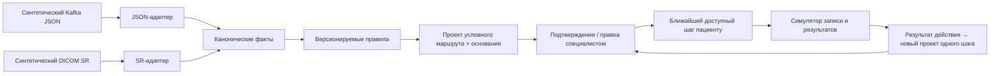

# Демонстрация архитектуры на синтетических данных

**Статус:** проект реализации, 04.10.2026. Текущая модель одного шага и лабораторной подготовки описана в [next-step-cycle.md](next-step-cycle.md); ниже остаются исходные интеграционные сценарии. Все медицинские маршруты в демо — учебные гипотезы; клиническое применение требует утверждения специалистом.

## Идея демонстрации

Показать один продукт, который принимает разные представления результата ИИ и работает внутри разных учреждений без изменения ядра. Центральный объект — **версия следующего шага**: не более одного клинического действия, основание, решение специалиста и необязательные задачи подготовки. Версии связываются по результату действия. Клиника выбирает поддерживаемые адаптеры и задаёт техническое сопоставление полей и услуг.



Синтетические данные создаются из **схемы и значений, описанных в БФТ**, и содержат вымышленные идентификаторы. В фикстурах и на экране указать `synthetic: true`. Не представлять эти файлы как реальные сообщения «Третьего мнения» или проверенную совместимость с конкретным PACS.

## Граница ядра

Ядро получает `CanonicalReport`, не Kafka-сообщение и не DICOM-файл. Минимальный контракт:

```yaml
CanonicalReport:
  case_ref: synthetic-case-001
  encounter_ref: synthetic-encounter-001
  study_uid: 1.2.826.0.1.3680043.10.2026.1
  source_version: 1
  modality: CT_CHEST  # или MAMMOGRAPHY
  exam_purpose: unknown  # screening | diagnostic | unknown
  facts:
    - code: example_finding_code
      value: example_value
      source_pointer: aiResult.probParams.example
  received_at: 2026-10-04T12:00:00+03:00
  synthetic: true
```

Значения в этом блоке показывают **форму канонической модели**, а не утверждённые клинические коды. Сохранять также ссылку на исходный объект и хеш версии. В коде отделить интерфейсы `ReportSource`, `FieldMapper`, `RouteRuleSet`, `ClinicalDecisionPort`, `ServiceCatalogPort`, `BookingPort`, `ResultPort`, `NotificationPort`. Профиль учреждения связывает конкретные реализации; бизнес-правила зависят только от канонических фактов и статусов маршрута.

## Два профиля, одна логика

| Профиль демо | Вход и контекст | Выход и запись |
| --- | --- | --- |
| Условная частная клиника | Kafka JSON по демонстрационной схеме БФТ; синтетическая МИС | Виджет подтверждения, локальный каталог и симулятор записи |
| Условное государственное учреждение | Сгенерированный DICOM SR через симулятор PACS; синтетическая связь исследования с приёмом | API подтверждения, иной каталог и симулятор записи |

Нельзя гарантировать, что реальная клиника подключится одним переключателем: неизвестные протоколы требуют нового адаптера. Демонстрация показывает, что добавление адаптера и профиля не меняет правила маршрута. Для каждого профиля конфигурация версионируется, проверяется на валидность и может быть откатана.

## Сценарии, которые нужно проиграть

1. **Одинаковый результат разными каналами.** Эквивалентные КТ или маммографические факты в JSON и SR дают одинаковый `CanonicalReport` и один и тот же проект маршрута. Проверяется переносимость ядра.
2. **Подтверждение во время приёма.** Проект показывает специалисту точные сработавшие поля и условия; пациент ничего не видит до `approve` или `edit_and_approve`. После решения доступен ближайший шаг и запись.
3. **Следующий цикл.** После записи и даже после оказания первой услуги нового шага ещё нет. По получении результата `followup_needed`/`replan` создаётся связанный ручной проект одного шага; пациент увидит его только после решения специалиста. Результат `resolved` закрывает цикл.
4. **Исправление специалистом.** Сохраняются исходный проект, исправленный путь, причина и версия правила. Исправление поступает в очередь разбора качества; правила автоматически не меняются.
5. **Исправленное заключение ИИ.** Новая версия с тем же `study_uid` пересчитывает проект, не удаляя опубликованный путь и запись без отдельного решения. Повтор той же версии не создаёт дубликат.
6. **Неизвестное назначение исследования или неподдержанная формулировка.** Зависимое от скрининга/диагностики правило не срабатывает; интерфейс показывает причину воздержания и ручной выбор.
7. **Параллельная подготовка.** Специалист добавляет лабораторное условие `before_execution`; пациент может организовать анализ и основной шаг параллельно, но результат основного шага блокируется до принятого действующего результата анализа.
8. **Нет слотов или ошибка интеграции.** Сохраняется подтверждённый путь, создаётся задача координатору, повтор запроса записи идемпотентен.

Для медицинских демонстрационных правил использовать метки `HYPOTHESIS`, явное указание источника и версии. Первые группы фактов: BI-RADS по каждой молочной железе и лёгочные узлы КТ. Не выводить из синтетического набора доказательство клинической точности или роста конверсии.

## Проверки и метрики демо

| Что измерить | Ожидаемое доказательство |
| --- | --- |
| Парсинг и переносимость | Для эквивалентных фикстур разных форматов совпадают канонические факты и проект пути |
| Безопасность переходов | Нет второго предсозданного шага; новый проект появляется после результата, подготовка проверяется перед выполнением, неподтверждённый проект не публикуется |
| Идемпотентность и версии | Повтор события не создаёт новый путь или запись; исправление создаёт новую версию |
| Объяснимость | Каждый шаг указывает исходные поля, значения, правило и версию |
| Скорость | Измерение `получен SR/JSON → проект пути` по p95/p99 на заданном синтетическом потоке; отдельно показывать ожидание решения специалиста |
| Воронка | События `result_received → route_proposed → approved → shown → booking_confirmed → action_completed`; возможны технические показатели на синтетике, но не реальный uplift |

Критерий успеха демо — воспроизводимое поведение ядра и корректные границы интеграции. Совместимость с промышленным SR, клиническая пригодность правил и изменение конверсии проверяются позднее на данных и процессе конкретного учреждения.
